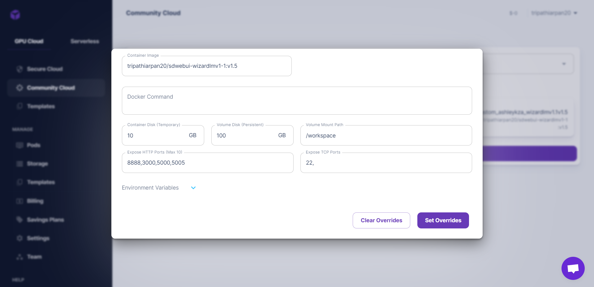
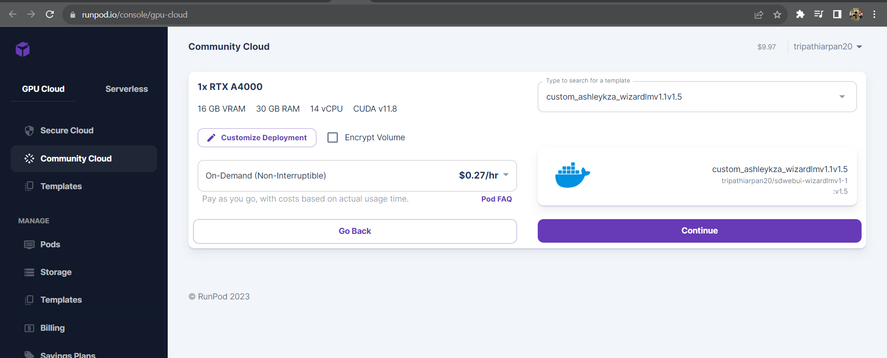
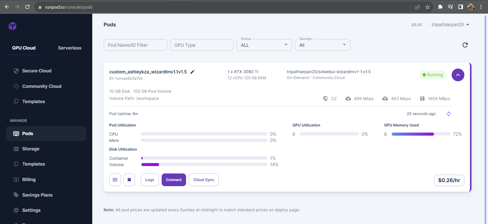
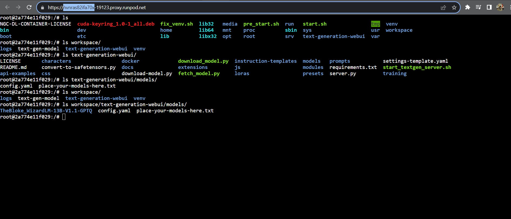

[Demo videos](https://youtube.com/playlist?list=PLT2iBnm59O8t4iR40XcsdL3nLRs-Z0X6t&si=hL9lYdjMdaLQjuf7)

https://github.com/tripathiarpan20/self-improvement-4all/assets/42506819/878f8f5c-aef9-445c-8826-38be397c3d2a


# Self-improvement-4-all

This project is done under the partial fulfilment of MSc AI & ML course at The University of Birmingham.

# Background

In the contemporary world with an uncertain future and the widespread sense of self-alienation among modern people, there is a necessity of universal support for self-improvement. This project aims to make such support more accessible by using the intrinsic knowledge and empathy towards users present in open-source chat and instruction-based LLMs, with sensitivity towards user-data privacy.

Under this project, the objectives/implemented features are as follows:
- [ ] Implementation of Plan-Act-Reflect pardigm from [Generative Agents paper](https://arxiv.org/abs/2304.03442) by Stanford to simulate a proxy of a self-improvement coach, by utilising a backend LLM.
- [ ] Support for deploying backend LLM locally with GPU acceleration using [GPTQ](https://github.com/IST-DASLab/gptq)/[GGML](http://ggml.ai/) based models with Huggingface, accessible via API, either using [text-generation-inference](https://github.com/huggingface/text-generation-inference) by Huggingface or [text-generation-webui](https://github.com/oobabooga/text-generation-webui) openai API extension.
- [ ] Support for deploying backend LLM on cloud services, specifically, using [inference-endpoints](https://huggingface.co/inference-endpoints) or [Runpod.io](https://www.runpod.io/).
- [ ] Support for a simplistic chat UI based on Streamlit.

Additional scope:
- [ ] Compatibility with future open-source/LLaMa-based models via integration with Huggingface/oobabooga text-generation-webui, assuming sufficient alignment, instruction-following capabilities and knowledge of psychology in the LLM.


# Installation

The instructions to run the work on Google Colab is provided in the [notebook](https://colab.research.google.com/drive/1xi8cQSrYpoI4Xwo6k1wMl4SgZKXA77xI?usp=sharing) and can be run free of cost on the Tesla T4 instance under a daily quota limit.

An illustrated walkthrough for the remote deployment of the LLM container is provided in the final dissertation report.

The first step involves building the Docker container:
```
git clone https://github.com/tripathiarpan20/text-generation-docker.git
cd text-generation-docker
wget https://raw.githubusercontent.com/tripathiarpan20/self-improvement-4all/main/Dockerfile.standalone
rm Dockerfile
mv Dockerfile.standalone Dockerfile
docker build -t <username>/self-improv-4-all:v1 
docker push <username>/self-improv-4-all:v1 
```
Note that a custom model can be replaced with the appropriate loader (like GPTQ, GGML, ctransformers etc) given the compatibility of the checkpoint by making changes similar to the ones in [this comparison](https://github.com/ashleykleynhans/text-generation-docker/compare/main...tripathiarpan20:text-generation-docker:main) to the `text-generation-docker` fork repository.

After the above commands are successfully run, the docker container would be available on Dockerhub and ready to deploy on Runpod. 

Next, go to [runpod.io](https://www.runpod.io/) and sign up and add credits, on the dashboard go to the 'Templates' option under the 'Manage' tab, and choose the 'New Template' option.
Fill the required fields with the container name by replacing `<username>` as required, an example is given below:



Next, go to the 'Community Cloud' choose a GPU tier to deploy the container template on a suitable GPU as a pod, the pod with the chosen model (WizardLM v1.1 13B) has been tested to work sufficiently on the RTX A4000 16GB VRAM instance. 


Once the pod has finished deploying, accessible via the 'Pods' section under the 'Manage' tab, select 'Start Web Terminal, followed by 'Connect to web terminal', which opens a new window with a shell instance for further interaction. 
After waiting for a few minutes, the model would automatically load, this can be highlighted via the availability of all the displayed HTTP ports and increased GPU usage in the UI.


Upon the proper deployment of the pod, copy the address of the pod in the launched web terminal, as highlighted in the search bar in the screenshot below: 



Then on the Linux client system, setup the repository with the following commands:
```
git clone https://github.com/tripathiarpan20/self-improvement-4all
cd self-improvement-4all
```
In the `streamchat_runpod.py` file, replace the ID in the `URI` variable, for example:  
`URI = 'wss://ay7akx8j6pesjm-5005.proxy.runpod.net/api/v1/chat-stream'`, here we would need to replace `ay7akx8j6pesjm` with the Runpod pod ID.

Then setup the virtual environment for the application:
```
sudo apt install python3.10-venv git-lfs
python3 -m venv selfimprov4all
source selfimprov4all/bin/activate
pip install -r requirements.txt
mkdir -p vector_mems
mkdir -p logs
git-lfs clone https://huggingface.co/intfloat/e5-base-v2 models/e5-base-v2
```

Finally, execute the script:
```
streamlit run streamlit_runpod.py
```
Then open the outputted 'Internal URL' link to access the UI, which communicates with the deployed pod on Runpod for LLM inference.

# Background

In the contemporary world with an uncertain future and the widespread sense of self-alienation among modern people, there is a necessity of universal support for self-improvement. This project aims to make such support more accessible by using the intrinsic knowledge and empathy towards users present in open-source chat and instruction-based LLMs, with sensitivity towards user-data privacy.

Under this project, the objectives/implemented features are as follows:
- [X] Implementation of Plan-Act-Reflect pardigm from [Generative Agents paper](https://arxiv.org/abs/2304.03442) by Stanford to simulate a proxy of a self-improvement coach, by utilising a backend LLM.
- [X] Support for deploying backend LLM locally with GPU acceleration using [GPTQ](https://github.com/IST-DASLab/gptq)/[GGML](http://ggml.ai/) based models with Huggingface, accessible via API, either using [text-generation-inference](https://github.com/huggingface/text-generation-inference) by Huggingface or [text-generation-webui](https://github.com/oobabooga/text-generation-webui) openai API extension.
- [X] Support for deploying backend LLM on cloud services, specifically, using [inference-endpoints](https://huggingface.co/inference-endpoints) or [Runpod.io](https://www.runpod.io/).
- [X] Support for a simplistic chat UI based on Streamlit.

Additional scope:
- [X] Compatibility with future open-source/LLaMa-based models via integration with Huggingface/oobabooga text-generation-webui, assuming sufficient alignment, instruction-following capabilities and knowledge of psychology in the LLM.


# References:
- [Langchain](https://github.com/hwchase17/langchain)
- [Generative Agents](https://arxiv.org/abs/2304.03442)
- [Huggingface Transformers](https://github.com/huggingface/transformers)
- [FAISS](https://github.com/facebookresearch/faiss)
- [GPTQ](https://github.com/IST-DASLab/gptq)
- [AutoGPTQ](https://github.com/PanQiWei/AutoGPTQ)
- [text-generation-inference](https://github.com/huggingface/text-generation-inference)
- [text-generation-webui](https://github.com/oobabooga/text-generation-webui)

# Evaluation
The evaluation was done through the [evaluation form](https://forms.gle/4hZDo9GcxcY3fVD19) based on ~30 reviews. The insights have been reported in the final dissertation report.

# Scope for Future work:
- [ ] Extension of the work to virtual therapy, requiring sufficient alignment and knowledge within the designated LLM.
- [ ] Extension to the 'Plan' module of Generative agents using Langchain agents framework, with an aim such as 'mitigate the negative elements of user's mental health'.
- [ ] Integration of LLM outputs with open-source text-to-speech modules, while integrating assert-vocal-emotion 'tool' (as in Langchain tools) with the LLM. 
- [ ] Enhancing privacy protection by deploying text tokenizer on the frontend and transmit token indices' sequence in API calls, assuming token indices to be unique to the model.
- [ ] Enhancing defence against prompt injection attacks for added safety.

# License:
All usage of this work is permitted except the ones mentioned below.

# Forbidden usage:
- Usage of this work or derivatives of this work with closed-source OpenAI/Google/Anthropic models to create services that erroneously ensures data-privacy/data-ownership to users.
